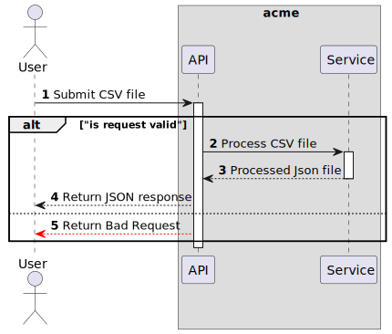

# File Service (POC)

An example spring boot application to handle file uploads and processing.

---

### Features

#### 1. CSV Upload and Processing (User-Facing Feature)

This feature involves allowing users to upload a CSV file via a REST API endpoint and processing the data of the
uploaded file and returning a mapped representation of the data in JSON format to the user.
At the moment, this feature restricts the file size to 1MB and only accepts CSV files in a specific format.

This feature also implements a validation mechanism to ensure the uploaded file is in the correct format and adheres to
the specified rules.
If the file does not meet the requirements, the system returns an error



**Future Enchantments**

- Allow ingesting of different CSV files formats with difference processing rules.
- Implement an Asynchronous processing mechanism to handle large files and long processing times.

#### 2. Geo-Location Request Blocking Requests (Security Feature)

This feature implements a security measure to block requests based on the IP location of the requester, according to
configurable rule policies It allows engineers to configure specific rules and policies governing which geographic
regions, data centre origins, etc., are allowed or denied access to the system.
By restricting access and returning unauthorised access error codes, it enhances the system's security posture.

This feature integrates with a partner API, IP-API, to retrieve detailed IP data for each request.
This data includes the country code and various other pertinent information about the requester,
providing comprehensive insights into the origin of the request.


**Future Enchantments**

- Implement a caching mechanism to store IP data and reduce the number of API calls.

**Alternative considerations**

- Delegate this feature to a dedicated security service or firewall solution so this microservice can focus on its core
  functionality.

#### 3. Storing Request Data and IP Information (Data Management Feature)

This feature relies on the IP information captured from each request and integrates with a relational
database to store both the request data and the associated IP information.
By storing this data in a structured format, the system maintains a comprehensive record of requests and their
corresponding IP details for future reference and analysis.


**Future Enchantments**

- Implement asynchronous processing to handle large volumes of requests and reduce the impact on the main application.

**Alternative considerations**

- Delegate this feature to a dedicated data management service to optimise performance. By decoupling with queue
  solution information can be sent asynchronously to the data management service to be processed. allowing this micro
  service to focus on its core functionality.

---

### Running the project

To run the project locally, ensure to install the project to it can generate a JAR file

```bash
make install
```

THe command above will install the project via docker and generate a JAR file at the root file of this project

```bash
make run
```

The project will run via docker in a secured java environment and will be available on port 9090

Alternatively, you can run the project via docker compose shipped with mysql; the command bellow uses Dockerfile to
build the project before spinning up the containers

```bash
make run_with_mysql
```

---

### Testing the project running via health endpoint

```bash
curl --location 'http://localhost:9090/app/actuator/health'
```
